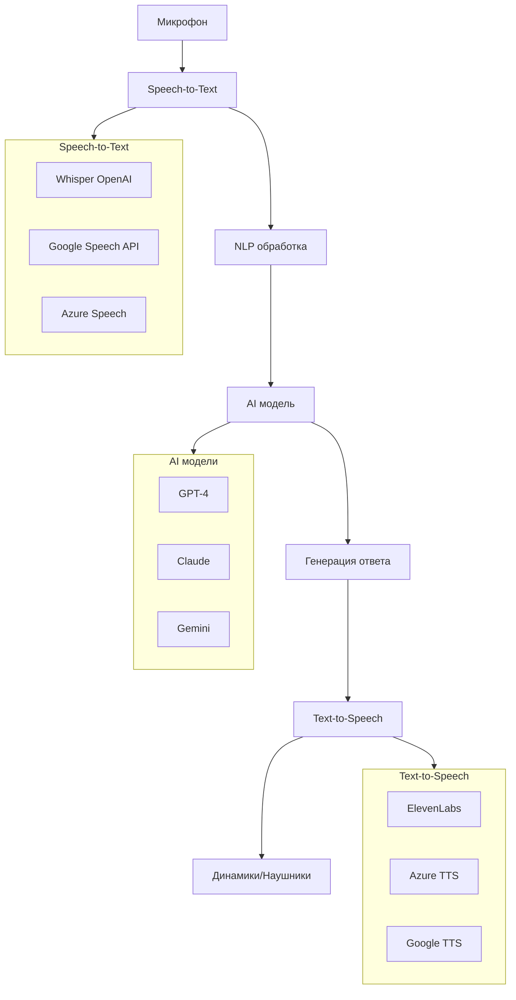
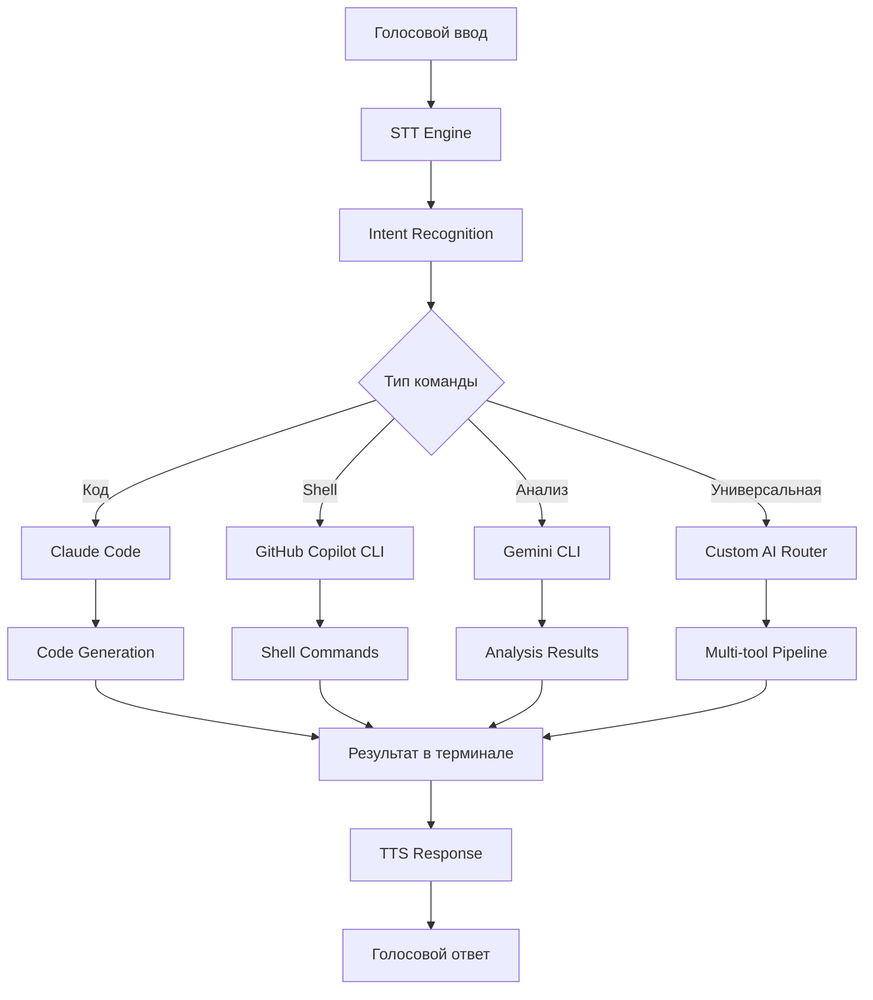

# Голосовые AI-агенты: Будущее интерфейсов уже здесь

В последние годы мы наблюдаем революцию в способах взаимодействия с искусственным интеллектом. Голосовые AI-агенты становятся не просто удобным дополнением, а полноценной альтернативой традиционным текстовым интерфейсам. В нашем исследовании мы рассмотрели различные подходы к созданию голосовых помощников и их интеграции с существующими инструментами.

## Что мы изучили

В процессе изучения голосовых AI-интерфейсов мы исследовали несколько ключевых направлений:

### Системные решения для голосового ввода
- **Windows Speech Recognition** и встроенная диктовка (Win+H)
- **macOS Dictation** с поддержкой Enhanced Dictation
- **Linux-решения** на базе Mozilla DeepSpeech и Kaldi

### Готовые платформы и приложения
- **OpenAI Desktop App** с продвинутым голосовым режимом
- **Claude Desktop** (пока без голосового ввода, но с потенциалом развития)
- Специализированные инструменты как **Otter.ai** и **Tabnine Voice**

### Открытые решения и фреймворки
- **Open Interpreter** с поддержкой микрофонного ввода
- **AutoGPT** с голосовыми расширениями
- **LangChain** агенты с интеграцией speech-to-text

## Категории голосовых AI-инструментов

### 1. Универсальные помощники
Эти инструменты предназначены для широкого спектра задач:
- Ведение диалогов на любые темы
- Помощь в планировании и организации
- Поиск информации и ответы на вопросы
- Создание контента и документов

**Примеры:** OpenAI Voice Mode, Google Assistant, Amazon Alexa

### 2. Специализированные помощники для разработчиков
Инструменты, заточенные под программирование:
- Голосовое написание кода
- Рефакторинг и отладка через голосовые команды
- Объяснение сложного кода
- Создание документации

**Примеры:** GitHub Copilot Voice, Tabnine Voice, Cursor с голосовыми командами

### 3. Инструменты транскрибации и анализа
Решения для обработки речи:
- Преобразование речи в текст
- Анализ тональности и эмоций
- Суммаризация встреч и лекций
- Создание структурированных заметок

**Примеры:** Otter.ai, Rev.ai, AssemblyAI

### 4. Персональные AI-ассистенты
Кастомизируемые решения под конкретные нужды:
- Настройка под индивидуальный рабочий процесс
- Интеграция с личными данными и предпочтениями
- Обучение на специфических задачах
- Приватность и локальная обработка

**Примеры:** Open Interpreter, локальные Whisper установки

## Комбинированные наборы инструментов

### Полный стек голосового AI


### Архитектура интеграции
Современные голосовые AI-системы часто используют модульную архитектуру:
- **Уровень захвата аудио** (микрофоны, шумоподавление)
- **Уровень распознавания речи** (STT движки)
- **Уровень обработки** (NLP, контекст, память)
- **Уровень AI-рассуждений** (языковые модели)
- **Уровень синтеза речи** (TTS движки)
- **Уровень интерфейса** (GUI, уведомления, интеграции)

## Кейсы использования

### 1. Разработка программного обеспечения
**Сценарий:** Программист работает над сложным проектом
- Диктовка кода во время прогулки или поездки
- Голосовое объяснение логики коллегам
- Быстрое создание комментариев и документации
- Рефакторинг через естественные команды

**Инструменты:** GitHub Copilot Voice + IDE интеграция

### 2. Контент-creation и блоггинг
**Сценарий:** Создание статей и обзоров
- Диктовка черновиков статей
- Голосовое редактирование и улучшение текста
- Создание структуры контента через диалог
- Переработка материала в разные форматы

**Инструменты:** OpenAI Voice + Notion/Obsidian интеграция

### 3. Исследования и обучение
**Сценарий:** Студент или исследователь изучает новую область
- Голосовые вопросы по сложным темам
- Создание конспектов через диктовку
- Интерактивное изучение с обратной связью
- Подготовка к экзаменам через диалог

**Инструменты:** Claude Voice + специализированные базы знаний

### 4. Бизнес-аналитика и планирование
**Сценарий:** Менеджер планирует стратегию
- Голосовое brainstorming сессии
- Создание презентаций через диктовку
- Анализ данных через естественные вопросы
- Планирование проектов в диалоговом режиме

**Инструменты:** Custom AI агенты + бизнес-системы

### 5. Персональная продуктивность
**Сценарий:** Повседневная организация задач
- Голосовое добавление задач в todo-листы
- Планирование дня через диалог
- Напоминания и уведомления с контекстом
- Анализ эффективности через разговор

**Инструменты:** Siri Shortcuts + AI интеграция

### 6. Креативная работа
**Сценарий:** Художник или дизайнер ищет вдохновение
- Голосовое описание концепций
- Генерация идей через диалог
- Обсуждение цветовых схем и композиции
- Создание технических заданий

**Инструменты:** Midjourney Voice + творческие AI

## Технические вызовы и решения

### Задержка (Latency)
- **Проблема:** Время между речью и ответом
- **Решение:** Локальные модели, оптимизация pipeline, предикативная обработка

### Точность распознавания
- **Проблема:** Ошибки STT в шумных условиях или с акцентами
- **Решение:** Адаптивные модели, контекстная коррекция, пользовательская настройка

### Приватность
- **Проблема:** Обработка чувствительной информации
- **Решение:** Локальная обработка, end-to-end шифрование, анонимизация

### Многоязычность
- **Проблема:** Поддержка разных языков и переключение между ними
- **Решение:** Мультиязычные модели, автодетекция языка, смешанный ввод

## Интеграция с CLI инструментами

### Современные CLI AI-инструменты

Командная строка переживает ренессанс благодаря новому поколению AI-инструментов. Голосовая интеграция с ними открывает принципиально новые возможности работы:

#### **Claude Code**
- Голосовые команды для анализа кодовой базы
- Диктовка технических требований для реализации
- Голосовое объяснение архитектурных решений
- Интерактивное планирование разработки

#### **OpenAI Codex (GitHub Copilot CLI)**
- Голосовое описание желаемой функциональности
- Устные команды для генерации shell-скриптов
- Объяснение сложных команд естественным языком
- Голосовая отладка и исправление ошибок

#### **Gemini CLI**
- Мультимодальный анализ (голос + изображения + код)
- Голосовые запросы к документации и API
- Устное планирование проектной архитектуры
- Интерактивное обучение новым технологиям

### Архитектура голосовой интеграции с CLI



### Практические кейсы интеграции

#### **1. Голосовая разработка с Claude Code**
```bash
# Голосовая команда: "Проанализируй этот React компонент и предложи оптимизации"
voice-claude analyze --component UserProfile.tsx --optimize

# Голосовая команда: "Создай новый API endpoint для получения пользователей"
voice-claude generate --type api --entity users --operation get
```

**Сценарий использования:**
- Программист диктует требования во время прогулки
- Claude Code анализирует проект и создает план реализации
- Голосовое подтверждение каждого шага разработки
- Автоматическое создание тестов и документации

#### **2. Системное администрирование с Copilot CLI**
```bash
# Голосовая команда: "Найди все процессы, использующие больше 80% CPU"
voice-copilot shell "find high cpu processes"

# Голосовая команда: "Создай бэкап базы данных PostgreSQL"
voice-copilot backup --database postgresql --name myapp
```

**Сценарий использования:**
- DevOps инженер управляет серверами голосом во время инцидента
- Быстрое выполнение сложных команд через естественный язык
- Голосовые уведомления о статусе операций
- Автоматическое логирование всех действий

#### **3. Исследовательская работа с Gemini CLI**
```bash
# Голосовая команда: "Объясни различия между GraphQL и REST API"
voice-gemini explain --topic "GraphQL vs REST" --depth advanced

# Голосовая команда: "Проанализируй этот лог файл и найди аномалии"
voice-gemini analyze --file error.log --type anomaly-detection
```

**Сценарий использования:**
- Исследователь изучает новую предметную область
- Быстрый анализ документов и данных
- Голосовые вопросы с контекстом предыдущих запросов
- Создание структурированных отчетов

### Специализированные интеграции

#### **Aider + Voice**
Голосовое программирование в паре с AI:
```bash
# "Aider, добавь в этот класс метод для валидации email"
voice-aider add-method --class User --method validate_email

# "Исправь все TypeScript ошибки в этом файле"
voice-aider fix --file components/Header.tsx --type typescript
```

#### **Cursor + Voice Commands**
Интеграция с редактором кода:
```bash
# "Курсор, создай компонент кнопки с темной темой"
voice-cursor generate component --name Button --theme dark

# "Объясни что делает эта функция"
voice-cursor explain --selection current
```

#### **Open Interpreter + Voice**
Локальное выполнение кода через голос:
```bash
# "Интерпретатор, создай график продаж за последний квартал"
voice-interpreter plot --data sales.csv --period quarter --type line

# "Обработай все изображения в папке и уменьши их размер"
voice-interpreter batch-resize --folder ./images --size 800x600
```

### Создание собственной голосовой CLI оболочки

#### Базовая архитектура
```python
import speech_recognition as sr
import pyttsx3
import subprocess
import json

class VoiceCLI:
    def __init__(self):
        self.recognizer = sr.Recognizer()
        self.tts = pyttsx3.init()
        self.load_command_mappings()
    
    def load_command_mappings(self):
        self.commands = {
            "claude": ["claude", "code analysis", "code generation"],
            "copilot": ["copilot", "shell command", "git help"],
            "gemini": ["gemini", "research", "explain", "analyze"]
        }
    
    def process_voice_command(self, text):
        # Определение намерения и маршрутизация к нужному CLI
        intent = self.classify_intent(text)
        return self.execute_cli_command(intent, text)
    
    def speak_response(self, text):
        self.tts.say(text)
        self.tts.runAndWait()
```

#### Продвинутые возможности
```bash
# Мультиинструментальные команды
voice-cli chain "claude analyze this code" | "copilot optimize" | "aider implement"

# Контекстные диалоги
voice-cli session start --context "working on React project"
voice-cli ask "how to add authentication?"
voice-cli implement --suggestion 1

# Персонализированные ярлыки
voice-cli alias create "deploy to staging" = "copilot deploy --env staging --confirm"
voice-cli shortcut "начни разработку" = "claude analyze project && aider start"
```

### Преимущества голосовых CLI интеграций

#### **Скорость и эффективность**
- Мгновенные команды без переключения контекста
- Параллельная работа с кодом и командами
- Быстрое исследование и экспериментирование

#### **Доступность**
- Работа без рук (ideal для людей с ограниченными возможностями)
- Использование во время ходьбы или физической активности
- Снижение нагрузки на глаза и руки

#### **Естественность взаимодействия**
- Описание задач естественным языком
- Контекстные диалоги с сохранением состояния
- Интуитивное управление сложными инструментами

#### **Продуктивность**
- Автоматизация рутинных задач
- Быстрое переключение между инструментами
- Уменьшение когнитивной нагрузки

### Вызовы и решения

#### **Точность распознавания**
- **Проблема:** Технические термины и команды
- **Решение:** Специализированные словари, контекстное обучение

#### **Безопасность**
- **Проблема:** Случайное выполнение критических команд
- **Решение:** Подтверждения для опасных операций, sandbox режим

#### **Приватность**
- **Проблема:** Передача чувствительных данных
- **Решение:** Локальное распознавание, шифрование, анонимизация

## Будущее голосовых AI-агентов

Мы находимся на пороге новой эры взаимодействия с компьютерами. Голосовые AI-агенты станут такими же естественными, как разговор с коллегой. Ключевые направления развития:

- **Multimodal интерфейсы** (голос + жесты + взгляд)
- **Эмоциональный интеллект** в голосовых помощниках
- **Персонализация** на основе индивидуального стиля общения
- **Проактивность** - агенты, которые сами предлагают помощь
- **Интеграция с IoT** и умными пространствами
- **Универсальные голосовые оболочки** для всех CLI инструментов

Голосовые AI-агенты уже сегодня меняют то, как мы работаем, учимся и творим. Завтра они станут неотъемлемой частью нашей цифровой жизни, а интеграция с CLI инструментами откроет новые горизонты производительности и креативности в разработке.