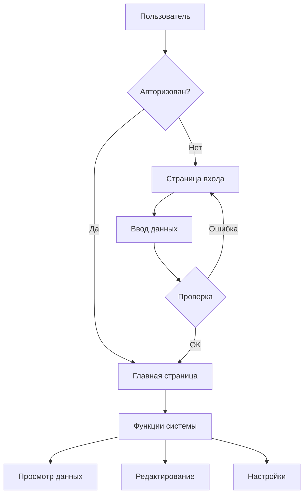
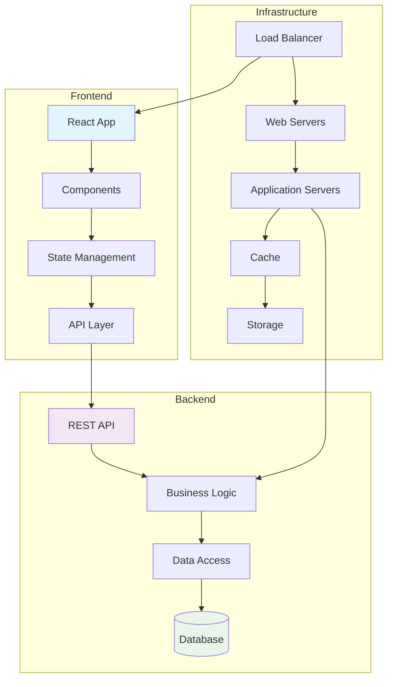

# Пример: Mermaid

Теперь Mermaid диаграммы отображаются в полном размере с удобным панорамированием и зумом!

## Простая диаграмма

```mermaid
flowchart TD
    A[Пользователь] --> B{Авторизован?}
    B -->|Да| C[Главная страница]
    B -->|Нет| D[Страница входа]
    D --> E[Ввод данных]
    E --> F{Проверка}
    F -->|OK| C
    F -->|Ошибка| D
    C --> G[Функции системы]
    G --> H[Просмотр данных]
    G --> I[Редактирование]
    G --> J[Настройки]
```

## Более сложная диаграмма

```mermaid
graph TB
    subgraph Frontend
        A[React App] --> B[Components]
        B --> C[State Management]
        C --> D[API Layer]
    end
    
    subgraph Backend
        E[REST API] --> F[Business Logic]
        F --> G[Data Access]
        G --> H[(Database)]
    end
    
    subgraph Infrastructure
        I[Load Balancer] --> J[Web Servers]
        J --> K[Application Servers]
        K --> L[Cache]
        L --> M[Storage]
    end
    
    D --> E
    I --> A
    K --> F
    
    style A fill:#e1f5fe
    style E fill:#f3e5f5
    style H fill:#e8f5e8
```
