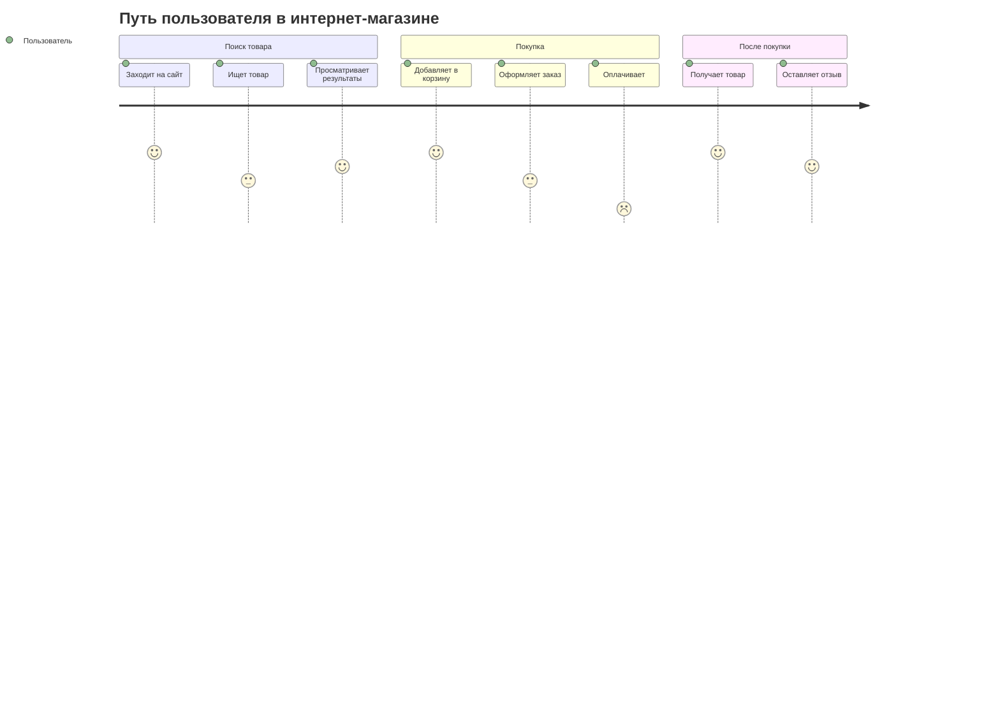
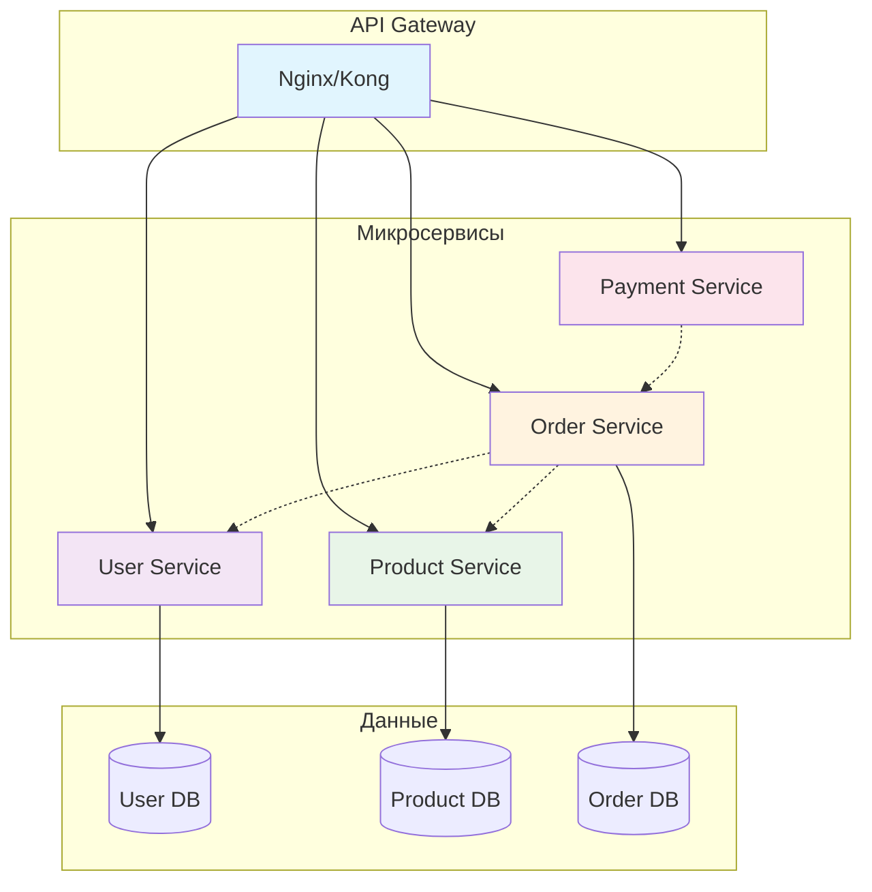

# UI компоненты

Примеры создания пользовательских интерфейсов с помощью диаграмм.

## Структура веб-приложения

```mermaid
flowchart TD
    subgraph "Header"
        Logo[Логотип]
        Nav[Навигация]
        Profile[Профиль]
    end
    
    subgraph "Sidebar"
        Menu[Меню]
        Filters[Фильтры]
    end
    
    subgraph "Main Content"
        Content[Основной контент]
        Pagination[Пагинация]
    end
    
    subgraph "Footer"
        Links[Ссылки]
        Copyright[Копирайт]
    end
    
    Logo --- Nav
    Nav --- Profile
    Menu --- Filters
    Content --- Pagination
    Links --- Copyright
    
    style Header fill:#e3f2fd
    style Sidebar fill:#f3e5f5
    style "Main Content" fill:#e8f5e8
    style Footer fill:#fff3e0
```

## Пользовательский путь



## Архитектура микросервисов


