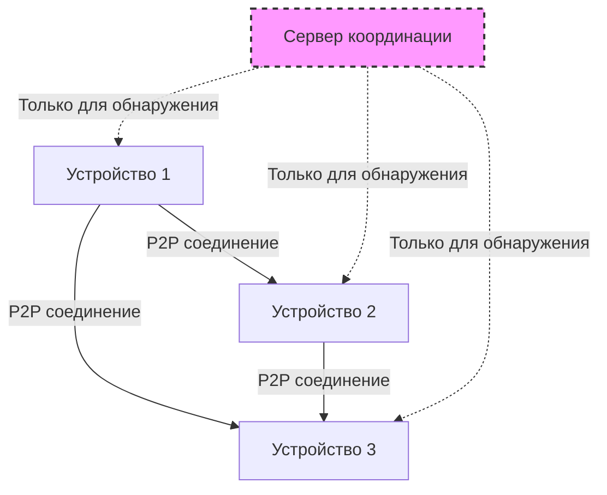
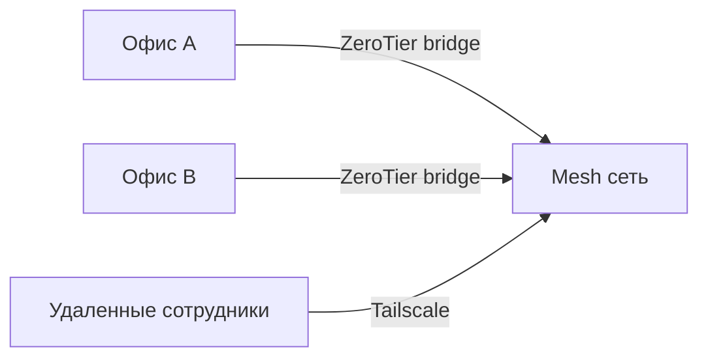

# ZeroTier vs Tailscale: Современные Mesh VPN для удаленной работы

## Что это и зачем нужно

**Простыми словами:** Mesh VPN - это виртуальная сеть, которая соединяет ваши устройства напрямую друг с другом через интернет, словно они находятся в одной локальной сети.

**Для кого:** Если вам нужно безопасно подключать удаленные устройства, офисы или просто получать доступ к домашним ресурсам из любой точки мира - эти инструменты решают такие задачи.

**Что получите:** Простая настройка защищенной сети без сложной конфигурации роутеров, портфорвардинга и статических IP-адресов.

## Предыстория и мотивация

Традиционные VPN требуют центрального сервера и сложной настройки. Все устройства подключаются к серверу, создавая узкое место в производительности и единую точку отказа.

### Почему классические решения не подошли

1. **OpenVPN/IPSec:** Сложная настройка, требуется сервер, производительность ограничена пропускной способностью сервера
2. **Корпоративные VPN:** Дорогие, избыточные для малого бизнеса и домашнего использования
3. **Port forwarding:** Небезопасно, сложно в управлении, не работает за NAT

## Техническая сторона вопроса

### Mesh VPN архитектура

**Принцип работы:**



**Объяснение компонентов:**
- **P2P соединения** - прямые зашифрованные туннели между устройствами
- **Сервер координации** - помогает устройствам найти друг друга, не передает данные
- **NAT traversal** - технологии пробивания NAT для создания прямых соединений

## ZeroTier: Программно-определяемые сети

### Как работает ZeroTier

**Архитектура:**
- **Planetary network** - глобальная сеть корневых серверов для координации
- **Network controllers** - управляют конфигурацией и правами доступа
- **Virtual Layer 2** - эмулирует Ethernet на 2-м уровне OSI

**Установка и использование:**

```bash
# Linux
curl -s https://install.zerotier.com | sudo bash

# Windows/macOS - скачать с сайта zerotier.com

# Присоединиться к сети
sudo zerotier-cli join [NETWORK_ID]

# Проверить статус
zerotier-cli listnetworks
```

### Плюсы ZeroTier:
- **Layer 2 VPN** - полная эмуляция локальной сети (broadcast, multicast)
- **Гибкая маршрутизация** - поддержка bridge режима
- **Масштабируемость** - до 100 устройств на бесплатном аккаунте
- **Открытый код** - можно развернуть собственную инфраструктуру

### Минусы ZeroTier:
- **Больше накладных расходов** - Layer 2 требует больше ресурсов
- **Сложность для новичков** - больше настроек сети
- **Производительность** - медленнее из-за полной эмуляции Ethernet

## Tailscale: WireGuard как сервис

### Как работает Tailscale

**Архитектура:**
- **WireGuard протокол** - современный VPN протокол в ядре
- **Coordination server** - управляет ключами и конфигурацией
- **Layer 3 VPN** - работает на IP уровне

**Установка и использование:**

```bash
# Linux (Ubuntu/Debian)
curl -fsSL https://pkgs.tailscale.com/stable/ubuntu/focal.gpg | sudo apt-key add -
curl -fsSL https://pkgs.tailscale.com/stable/ubuntu/focal.list | sudo tee /etc/apt/sources.list.d/tailscale.list
sudo apt update && sudo apt install tailscale

# Подключение
sudo tailscale up

# Статус
tailscale status
```

### Плюсы Tailscale:
- **Максимальная производительность** - WireGuard в ядре Linux
- **Простота настройки** - работает из коробки
- **Отличная интеграция** - поддержка SSO, ACL, DNS
- **Cross-platform** - все платформы, включая мобильные

### Минусы Tailscale:
- **Layer 3 только** - нет broadcast/multicast (не подходит для игр по LAN)
- **Проприетарный сервис** - зависимость от облака Tailscale
- **Ограничения бесплатного плана** - 20 устройств, 3 пользователя

## Детальное сравнение

### Производительность
- **Tailscale:** До 1 Гбит/с (WireGuard в ядре)
- **ZeroTier:** До 500 Мбит/с (userspace реализация)

### Простота использования
- **Tailscale:** Установил → авторизовался → работает
- **ZeroTier:** Требует создание сети и авторизацию устройств

### Бесплатный план
- **Tailscale:** 20 устройств, 3 пользователя, 1 подсеть
- **ZeroTier:** 100 устройств, 1 администратор

### Кейсы использования

**Выбирайте Tailscale если:**
- Нужна максимальная производительность
- Работаете с файлами и удаленным доступом
- Важна простота настройки
- Используете современные Linux дистрибутивы

**Выбирайте ZeroTier если:**
- Нужна полная эмуляция LAN (игры, legacy приложения)
- Требуется bridge режим
- Хотите больше устройств на бесплатном плане
- Планируете собственную инфраструктуру

## Практические применения

### Домашняя лаборатория
```bash
# Доступ к домашнему серверу из офиса
# SSH, веб-интерфейсы, файловые шары
```

### Удаленная команда разработчиков
- Доступ к internal ресурсам
- Shared development окружения
- Базы данных и CI/CD серверы

### Гибридная инфраструктура
- Связь между облачными и on-premise ресурсами
- Backup каналы между дата-центрами
- IoT устройства с центральным управлением

### Site-to-Site VPN


## Результаты тестирования

### Скорость подключения
- **Tailscale:** ~5 секунд до первого пакета
- **ZeroTier:** ~10-15 секунд (требуется авторизация)

### Потребление ресурсов
- **Tailscale:** ~10MB RAM, минимальная нагрузка на CPU
- **ZeroTier:** ~15MB RAM, больше CPU из-за userspace

### NAT traversal
- **Оба решения:** Отлично работают за любыми NAT
- **STUN/TURN:** Автоматический fallback через relay серверы

## Дальнейшее развитие

**Возможные улучшения:**
1. **Headscale** - self-hosted координационный сервер для Tailscale
2. **ZeroTier самохостинг** - собственные root серверы
3. **Интеграция с Kubernetes** - service mesh возможности
4. **Advanced routing** - сложные политики маршрутизации

**Полезные ссылки:**
- [Tailscale документация](https://tailscale.com/kb/)
- [ZeroTier документация](https://docs.zerotier.com/)
- [WireGuard протокол](https://www.wireguard.com/)
- [Headscale проект](https://github.com/juanfont/headscale)