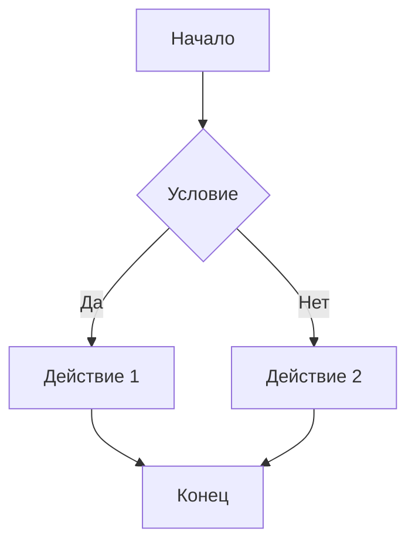
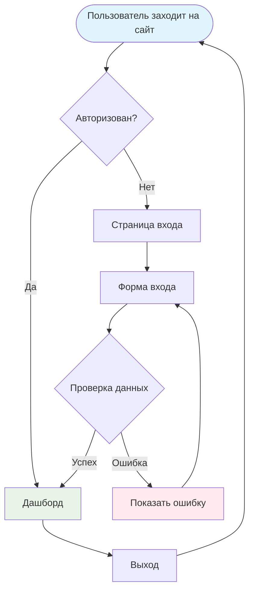
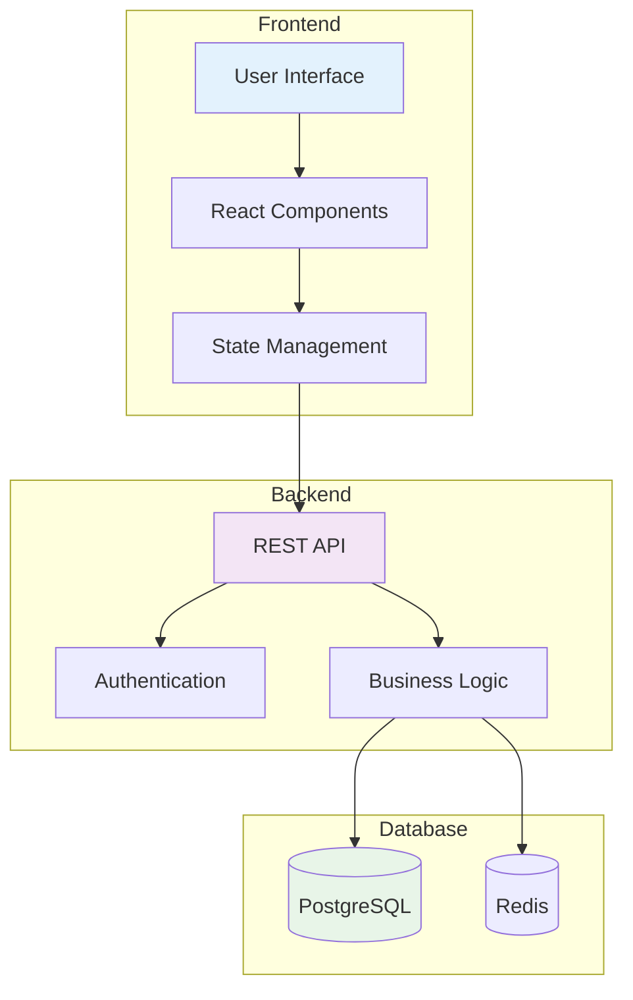

# Примеры диаграмм

Коллекция красивых Mermaid диаграмм для вдохновения.

## Простая блок-схема

```mermaid
flowchart TD
    A[Начало] --> B{Условие}
    B -->|Да| C[Действие 1]
    B -->|Нет| D[Действие 2]
    C --> E[Конец]
    D --> E
```

## Схема процесса авторизации

```mermaid
flowchart TD
    Start([Пользователь заходит на сайт]) --> Check{Авторизован?}
    Check -->|Да| Dashboard[Дашборд]
    Check -->|Нет| Login[Страница входа]
    Login --> Form[Форма входа]
    Form --> Validate{Проверка данных}
    Validate -->|Успех| Dashboard
    Validate -->|Ошибка| Error[Показать ошибку]
    Error --> Form
    Dashboard --> Logout[Выход]
    Logout --> Start
    
    style Start fill:#e1f5fe
    style Dashboard fill:#e8f5e8
    style Error fill:#ffebee
```

## Архитектура системы

```mermaid
graph TB
    subgraph "Frontend"
        UI[User Interface]
        React[React Components]
        State[State Management]
    end
    
    subgraph "Backend"
        API[REST API]
        Auth[Authentication]
        Logic[Business Logic]
    end
    
    subgraph "Database"
        DB[(PostgreSQL)]
        Cache[(Redis)]
    end
    
    UI --> React
    React --> State
    State --> API
    API --> Auth
    API --> Logic
    Logic --> DB
    Logic --> Cache
    
    style UI fill:#e3f2fd
    style API fill:#f3e5f5
    style DB fill:#e8f5e8
```
