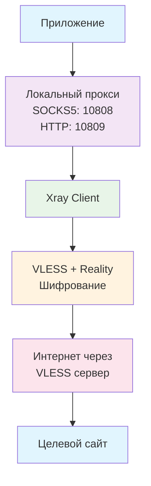

# Настройка VLESS через Xray на Windows

Полное руководство по установке и настройке VLESS подключения с использованием Xray-core на Windows.

## 🎯 Что такое VLESS?

**VLESS** - это современный протокол для обхода блокировок, развитие технологии V2Ray. Основные преимущества:

- 🚀 **Высокая скорость** - минимальные накладные расходы
- 🔒 **Reality протокол** - имитация реального HTTPS трафика  
- 🛡️ **Обход DPI** - устойчивость к глубокому анализу пакетов
- 🌐 **XTLS поддержка** - ускорение TLS соединений

## 🚀 Быстрая установка через скрипты

> **💡 Рекомендуемый способ!** Используйте готовые автоматические скрипты для упрощения установки.

📦 **[Скачать все скрипты](./scripts/)**

### Автоматическая установка:
1. 📥 **[1-install-xray.bat](./scripts/1-install-xray.bat)** - Скачивание и установка Xray + curl
2. ⚙️ **[2-setup-config.bat](./scripts/2-setup-config.bat)** - Настройка конфигурации
3. 🚀 **[3-start-xray.bat](./scripts/3-start-xray.bat)** - Запуск прокси
4. 🔍 **[4-check-connection.bat](./scripts/4-check-connection.bat)** - Проверка подключения  
5. 💻 **[5-powershell-proxy.bat](./scripts/5-powershell-proxy.bat)** - PowerShell с прокси

**Просто запустите скрипты по порядку!** 🎯

---

## 📥 Ручная установка

### Шаг 1: Скачивание Xray

```powershell
# Создание рабочей папки
mkdir D:\xray
cd D:\xray

# Скачивание последней версии Xray
Invoke-WebRequest -Uri "https://github.com/XTLS/Xray-core/releases/latest/download/Xray-windows-64.zip" -OutFile "xray.zip"

# Распаковка
Expand-Archive xray.zip -DestinationPath .
```

### Шаг 2: Установка curl для тестирования

```powershell
# Переход в домашнюю папку
cd C:\Users\%USERNAME%

# Скачивание curl
Invoke-WebRequest -Uri "https://curl.se/windows/dl-8.10.1_4/curl-8.10.1_4-win64-mingw.zip" -OutFile "curl.zip"

# Распаковка
Expand-Archive curl.zip
```

## ⚙️ Конфигурация

### Создание config.json

Сохраните в `D:\xray\config.json`:

```json
{
  "log": {
    "loglevel": "info"
  },
  "inbounds": [
    {
      "port": 10808,
      "protocol": "socks",
      "settings": {
        "auth": "noauth"
      }
    },
    {
      "port": 10809,
      "protocol": "http"
    }
  ],
  "outbounds": [
    {
      "protocol": "vless",
      "settings": {
        "vnext": [
          {
            "address": "your-server.com",
            "port": 443,
            "users": [
              {
                "id": "your-uuid-here",
                "encryption": "none",
                "flow": "xtls-rprx-vision"
              }
            ]
          }
        ]
      },
      "streamSettings": {
        "network": "tcp",
        "security": "reality",
        "realitySettings": {
          "serverName": "example.com",
          "fingerprint": "chrome",
          "publicKey": "your-public-key",
          "shortId": "your-short-id"
        }
      }
    }
  ]
}
```

### 📋 Извлечение параметров из VLESS ссылки

Для ссылки вида:
```
vless://UUID@SERVER:PORT?security=reality&sni=DOMAIN&pbk=PUBKEY&sid=SHORTID&type=tcp&flow=FLOW#NAME
```

**Соответствие параметров:**
- `UUID` → `"id": "UUID"`
- `SERVER:PORT` → `"address": "SERVER", "port": PORT`
- `sni=DOMAIN` → `"serverName": "DOMAIN"`
- `pbk=PUBKEY` → `"publicKey": "PUBKEY"`
- `sid=SHORTID` → `"shortId": "SHORTID"`
- `flow=FLOW` → `"flow": "FLOW"`

## 🚀 Автоматизация запуска

> **💡 Используйте готовые скрипты!** Все необходимые bat-файлы уже созданы в [папке scripts](./scripts/).

### Готовые скрипты из набора:
- 🚀 **[3-start-xray.bat](./scripts/3-start-xray.bat)** - Автоматический запуск с проверками
- 🔍 **[4-check-connection.bat](./scripts/4-check-connection.bat)** - Проверка работоспособности  
- 💻 **[5-powershell-proxy.bat](./scripts/5-powershell-proxy.bat)** - PowerShell с настройками прокси

### Создание bat-файлов вручную (если нужно)

**D:\xray\start_xray.bat:**
```batch
@echo off
echo ===============================
echo    ЗАПУСК XRAY ПРОКСИ
echo ===============================
echo.
echo Запуск Xray с конфигурацией...
echo Прокси будет доступен на:
echo   SOCKS5: 127.0.0.1:10808
echo   HTTP:   127.0.0.1:10809
echo.
echo Для остановки нажмите Ctrl+C
echo.
cd /d "D:\xray"
xray.exe run -config config.json
pause
```

**D:\xray\start_powershell_with_proxy.bat:**
```batch
@echo off
echo ===============================
echo   PowerShell с ПРОКСИ
echo ===============================
echo.
echo Настройка переменных прокси...
echo   HTTP_PROXY  = http://127.0.0.1:10809
echo   HTTPS_PROXY = http://127.0.0.1:10809
echo   ALL_PROXY   = socks5://127.0.0.1:10808
echo.
echo ВНИМАНИЕ: Убедитесь что Xray запущен!
echo.
echo Запуск PowerShell...
echo.

powershell.exe -NoExit -Command "& {$env:HTTP_PROXY='http://127.0.0.1:10809'; $env:HTTPS_PROXY='http://127.0.0.1:10809'; $env:ALL_PROXY='socks5://127.0.0.1:10808'; Write-Host 'Прокси настроен!' -ForegroundColor Green}"
```

**D:\xray\check_ip.bat:**
```batch
@echo off
echo ===============================
echo     ПРОВЕРКА IP АДРЕСА
echo ===============================
echo.
echo Проверка IP без прокси...
C:\Users\%USERNAME%\curl\curl-8.10.1_4-win64-mingw\bin\curl.exe ifconfig.me
echo.
echo.
echo Проверка IP через SOCKS5 прокси...
C:\Users\%USERNAME%\curl\curl-8.10.1_4-win64-mingw\bin\curl.exe --proxy socks5://127.0.0.1:10808 ifconfig.me
echo.
pause
```

## 🔧 Использование

### 🚀 С автоматическими скриптами (рекомендуется):

1. **Скачайте:** [Все скрипты из папки scripts](./scripts/)
2. **Установка:** Запустите `1-install-xray.bat`
3. **Настройка:** Запустите `2-setup-config.bat` (отредактируйте config.json)
4. **Запуск:** Запустите `3-start-xray.bat`
5. **Проверка:** Запустите `4-check-connection.bat`
6. **Работа:** Используйте `5-powershell-proxy.bat`

### 📋 Ручной способ:

1. **Запустите Xray:** Двойной клик по `start_xray.bat`
2. **Дождитесь сообщения:** "Xray started"
3. **Проверьте работу:** Запустите `check_ip.bat`
4. **Работайте через прокси:** Используйте `start_powershell_with_proxy.bat`

### Проверка подключения:

```powershell
# Через SOCKS5
curl --proxy socks5://127.0.0.1:10808 ifconfig.me

# Через HTTP
curl --proxy http://127.0.0.1:10809 ifconfig.me

# Детальная информация
curl --proxy socks5://127.0.0.1:10808 ipinfo.io
```

## 🌐 Настройка браузера

### Chrome/Edge:
1. Настройки → Дополнительные → Система
2. Открыть настройки прокси-сервера компьютера
3. Включить прокси-сервер
4. **SOCKS5:** `127.0.0.1:10808` (рекомендуется)
5. **HTTP:** `127.0.0.1:10809`

### Firefox:
1. Настройки → Прокси → Ручная настройка
2. **SOCKS Host:** `127.0.0.1`, **Port:** `10808`
3. Выбрать "SOCKS v5"

## 🛠️ Решение проблем

### ❌ "unexpected response version"
**Причина:** V2Ray не поддерживает современный Reality  
**Решение:** Используйте Xray вместо V2Ray

### ❌ "context canceled"
**Причина:** Проблемы с flow параметром  
**Решение:** Попробуйте убрать или изменить `"flow": "xtls-rprx-vision"`

### ❌ "connection refused"
**Причина:** Сервер недоступен или заблокирован  
**Решение:** 
1. Проверьте доступность: `Test-NetConnection SERVER PORT`
2. Попробуйте другую VLESS ссылку

### ❌ PowerShell не использует прокси
**Причина:** Invoke-WebRequest не поддерживает переменные прокси  
**Решение:** Используйте настоящий curl или настройте браузер

## 📊 Диаграмма работы VLESS



## 🔐 Безопасность

### Reality протокол:
- **Маскировка под реальный HTTPS** - трафик неотличим от обычного
- **TLS fingerprinting** - имитация популярных браузеров
- **SNI сокрытие** - использование доменов крупных сайтов

### Рекомендации:
- ✅ Регулярно обновляйте Xray
- ✅ Используйте актуальные параметры сервера
- ✅ Не логируйте чувствительные данные
- ⚠️ Не делитесь конфигурацией с UUID

## 📦 Скачать готовые скрипты

> **🎯 Упростите процесс!** Все необходимые файлы для автоматической установки и настройки.

### 📁 [Папка со скриптами](./scripts/)

- **[README.md](./scripts/README.md)** - Подробная инструкция по использованию
- **[1-install-xray.bat](./scripts/1-install-xray.bat)** - Автоматическая установка
- **[2-setup-config.bat](./scripts/2-setup-config.bat)** - Настройка конфигурации  
- **[3-start-xray.bat](./scripts/3-start-xray.bat)** - Запуск прокси
- **[4-check-connection.bat](./scripts/4-check-connection.bat)** - Проверка подключения
- **[5-powershell-proxy.bat](./scripts/5-powershell-proxy.bat)** - PowerShell с прокси

**Скачайте все файлы и следуйте инструкции в README.md!**

## 📝 Заключение

VLESS с Reality через Xray - это современное решение для обхода блокировок с высоким уровнем безопасности и производительности. Правильная настройка обеспечивает стабильное соединение даже в условиях жесткой интернет-цензуры.

**Ключевые преимущества:**
- 🚀 Высокая скорость благодаря XTLS
- 🔒 Надежное шифрование Reality
- 🛡️ Устойчивость к DPI анализу
- ⚙️ Простота автоматизации

**С готовыми скриптами весь процесс занимает 5-10 минут!** 🎯

---

*Статья написана на основе практического опыта настройки VLESS подключений на Windows.*