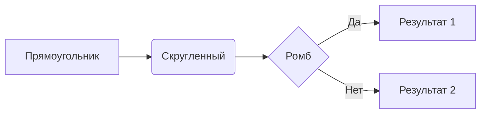
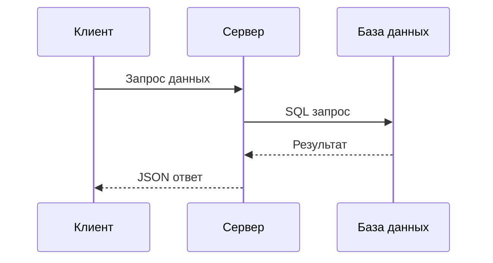
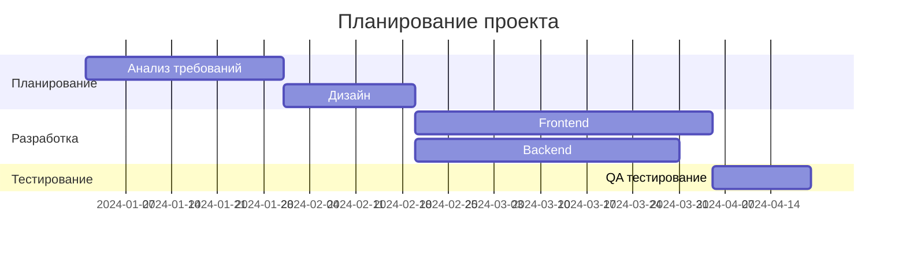

# Работа с Mermaid диаграммами

Подробное руководство по созданию интерактивных диаграмм в Mini Flowy.

## Что такое Mermaid?

Mermaid - это библиотека для создания диаграмм и схем из текста. В Mini Flowy диаграммы поддерживают:

- 🔍 **Панорамирование и зум**
- 📱 **Адаптивность**
- ⬇️ **Экспорт в SVG**
- 🎨 **Темная/светлая тема**

## Типы диаграмм

### Flowchart (Блок-схемы)

### Sequence (Диаграммы последовательности)

### Gantt (Диаграммы Гантта)

## Советы по созданию диаграмм

1. **Планируйте структуру** заранее
2. **Используйте понятные названия** узлов
3. **Группируйте связанные элементы** в подграфы
4. **Добавляйте стили** для важных элементов
5. **Тестируйте на разных размерах** экрана
